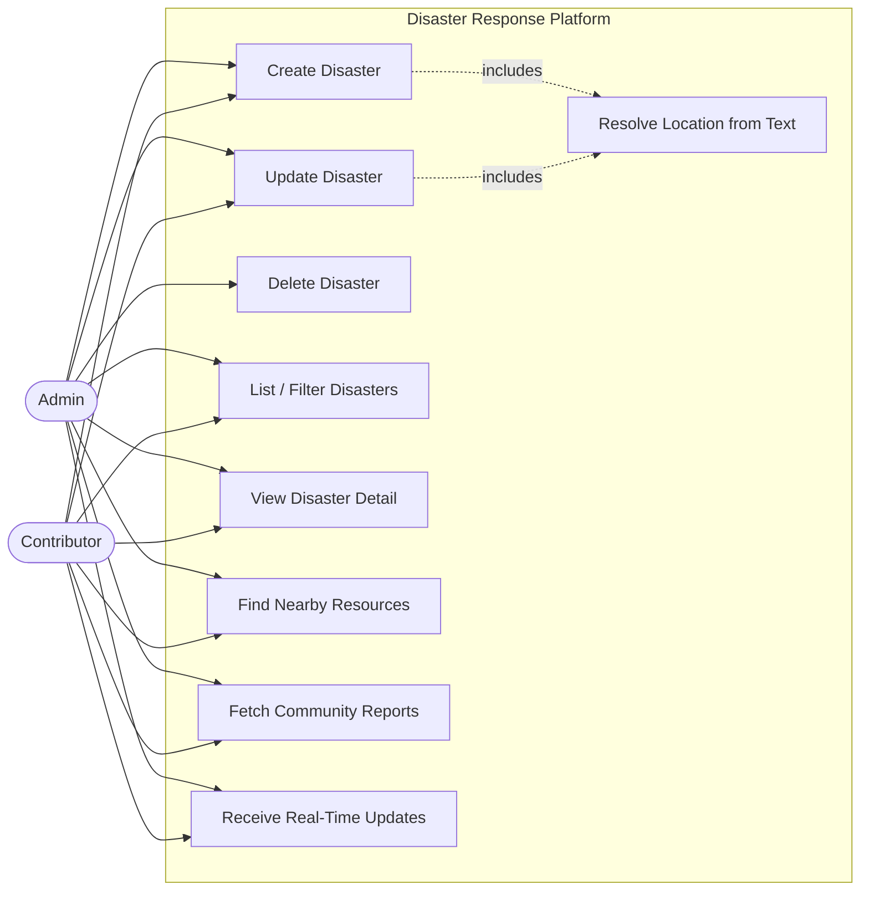
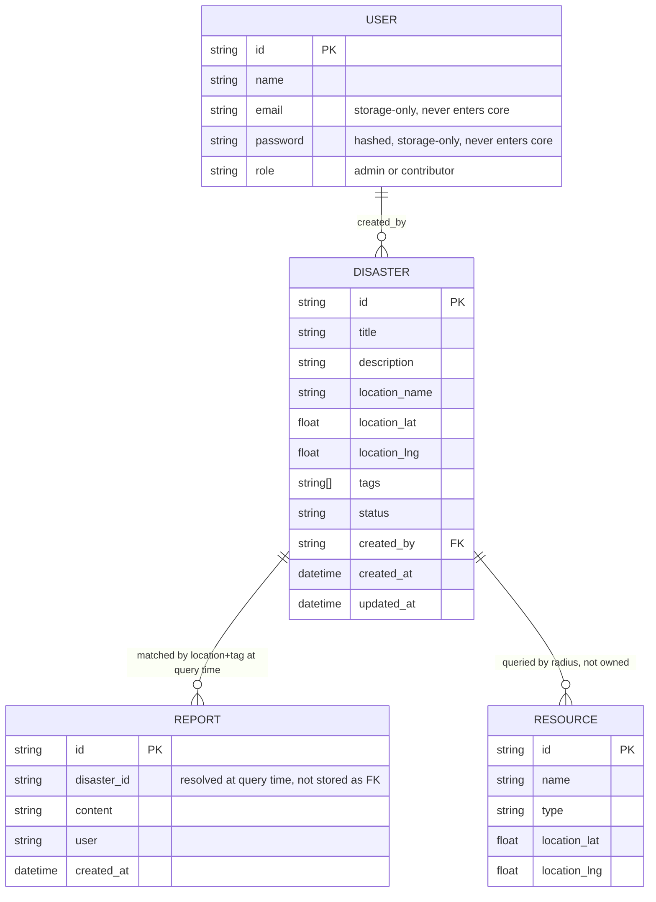

# Disaster Response Coordination Platform — System Architecture

## 1. Tech Stack

| Layer | Choice | Why |
|---|---|---|
| Language | TypeScript (strict mode) | Type-safe contracts across package boundaries |
| Runtime | Node.js | Standard fit for TS backend, fast to scaffold |
| Monorepo | npm/pnpm workspaces | Enforces `core` ↔ `apps` boundary at the package level, not just convention |
| HTTP framework | Express or Fastify (infra layer only) | Framework choice is invisible to `core` by design |
| Real-time | Socket.IO or native WebSocket/SSE | Emits `disaster_updated` on write operations |
| Test runner | Vitest | Native ESM/TS, fast, low config overhead across workspaces |
| Persistence (this phase) | None — in-memory adapters | Explicit constraint: prove the logic and boundaries before adding infra |
| Caching (this phase) | In-memory cache-aside adapter | Same reasoning — swappable for Redis later without touching `core` |

The stack is deliberately infra-light in this phase. Every external dependency (DB, cache, geocoding, social feed) is represented as a **port** in `core` and a **mock/in-memory adapter** in `apps/api`, so real infra can be swapped in later without touching business logic.

---

## 2. Folder Structure

```
disaster-response-platform/
├── package.json                 # root workspace config
├── tsconfig.base.json
├── .env.example
│
├── packages/
│   ├── shared-types/            # framework-free type contracts, shared by core + web
│   └── core/                    # pure business logic — zero infra/framework knowledge
│
└── apps/
    ├── api/                     # backend workspace — implements ports, exposes HTTP + realtime
    └── web/                     # frontend workspace — depends on shared-types only, never core
```

**Dependency direction (one-way, enforced by workspace package.json, not convention):**

```
shared-types  ←  core  ←  api
shared-types  ←  web
```

`core` never appears in `web`'s dependencies. `api` never implements business rules — it implements the interfaces `core` defines.

---

## 3. LLD Principles & How They're Applied

### Ports & Adapters (Hexagonal), lightweight
`core` defines **ports** (interfaces) for everything it needs from the outside world — persistence, geocoding, external report fetching, caching, event publishing. `apps/api` provides **adapters** that implement those ports. `core` is constructed by receiving adapters through its constructors (Dependency Injection) — it never instantiates or imports an adapter itself.

### SOLID, applied concretely
- **S — Single Responsibility**: each use-case (`CreateDisasterUseCase`, `GetNearbyResourcesUseCase`) does exactly one operation. Matching logic, distance calculation, and normalization each live in their own single-purpose service, not folded into a use-case.
- **O — Open/Closed**: new adapters (e.g. swapping in-memory cache for Redis) can be added without modifying `core` — only the composition root changes.
- **L — Liskov Substitution**: any adapter implementing a port (e.g. `MockGeocodingAdapter` vs a future `GoogleGeocodingAdapter`) must be swappable with no change in use-case behavior/contract.
- **I — Interface Segregation**: ports are narrow and specific (`ReportsSourcePort` only knows about fetching reports, not caching or persistence) rather than one large "external services" interface. The same principle applies to entities, not just ports: `core`'s `User` shape (`id`, `name`, `role`) exposes only what business logic needs to reason about. The full stored record (`email`, hashed `password`) exists only at the persistence boundary — the repository adapter maps it down to the narrow `User` shape before it ever reaches `core`. `core` has no way to read or leak credentials because it never has a type that contains them.
- **D — Dependency Inversion**: use-cases depend on port interfaces, never on concrete adapters. `core`'s `package.json` has no runtime dependency capable of violating this.

### Authentication vs. Authorization, split by layer
- **Authentication** (who is this?) is an HTTP-layer concern — middleware resolves a request into an `AuthenticatedUser { id, role }`.
- **Authorization** (are they allowed?) is a **core business rule**, enforced inside the relevant use-case (e.g. `DeleteDisasterUseCase` rejects non-admins) — not in middleware. This makes the rule testable without any HTTP involved, and impossible to bypass by hitting the use-case directly.

### Update semantics: conditional re-geocoding
`PATCH /disasters/:id` allows editing `title`, `description`, `tags`, and `status`. Location is **not** blindly re-resolved on every update — that would waste external geocoding calls for edits that don't touch location at all (e.g. a status change).

Instead: `UpdateDisasterUseCase` checks whether the disaster's **currently stored `location.name`** still appears as a substring of the **new** description. If it does, the location is assumed still valid and is left untouched — no geocoding call. If it doesn't (the place reference changed or was removed), the use-case re-invokes `GeocodingPort` to resolve a fresh location. This is a cheap, dependency-free heuristic that avoids unnecessary external calls while still correcting stale coordinates when the underlying facts actually changed — deliberately chosen over both "always re-geocode" (wasteful) and "never allow description edits" (fragments one real-world event into disconnected records, which would break resource/report continuity for that disaster).

### Feature-oriented internal organization
Inside `core/src/`, code is grouped by feature (`disasters/`, `resources/`, `reports/`, `shared/`), not by technical layer. Each feature folder owns its entity, use-cases, and ports; cross-feature use is an explicit import through the feature's `index.ts`, keeping each feature's public surface intentional.

### Testing strategy
- **Unit tests** — anything with no module boundary crossed: use-cases (with fake/in-memory port implementations), pure services like the report matcher. Located in `core/test/unit/`.
- **Integration tests** — anything crossing a real boundary: HTTP routes (supertest against the live app), adapters that talk to an external/mock service. Located in `apps/api/test/integration/`.

---

## 4. Use Case Diagram



---

## 5. Sequence Diagrams

Each major flow has its own diagram, kept as a separate `.mmd` file rather than one diagram trying to represent the whole system. Linked below by relative path:

| Flow | File |
|---|---|
| Authenticate request (identity resolution vs. authorization split) | [`authenticate-request.mmd`](/docs/diagrams/sequence/authenticate-request.mmd) |
| Create disaster (geocode → cache → persist → emit) | [`create-disaster.mmd`](/docs/diagrams/sequence/create-disaster.mmd) |
| Update disaster (conditional re-geocode on description change) | [`update-disaster.mmd`](/docs/diagrams/sequence/update-disaster.mmd) |
| Delete disaster (admin-only authorization demonstration) | [`delete-disaster.mmd`](/docs/diagrams/sequence/delete-disaster.mmd) |
| Get nearby resources (radius query + distance calc) | [`get-nearby-resources.mmd`](/docs/diagrams/sequence/get-nearby-resources.mmd) |
| Get disaster reports (cache → external fetch → normalize → match) | [`get-disaster-reports.mmd`](/docs/diagrams/sequence/get-disaster-reports.mmd) |

Plain reads (`GET /disasters`, `GET /disasters/:id`) are omitted — no branching or multiple participants worth diagramming.

---

## 6. Schema Diagram



Note: `RESOURCE` and `REPORT` are **not** foreign-keyed to `DISASTER` in storage — both relationships are computed at query time (spatial radius for resources, location+tag matching for reports), which is a deliberate design decision explained in the README.

`USER` shows the **full stored record**. `core`'s domain interface for `User` intentionally exposes only `{ id, name, role }` — `email` and `password` never cross into business logic (see Interface Segregation, Section 3).
